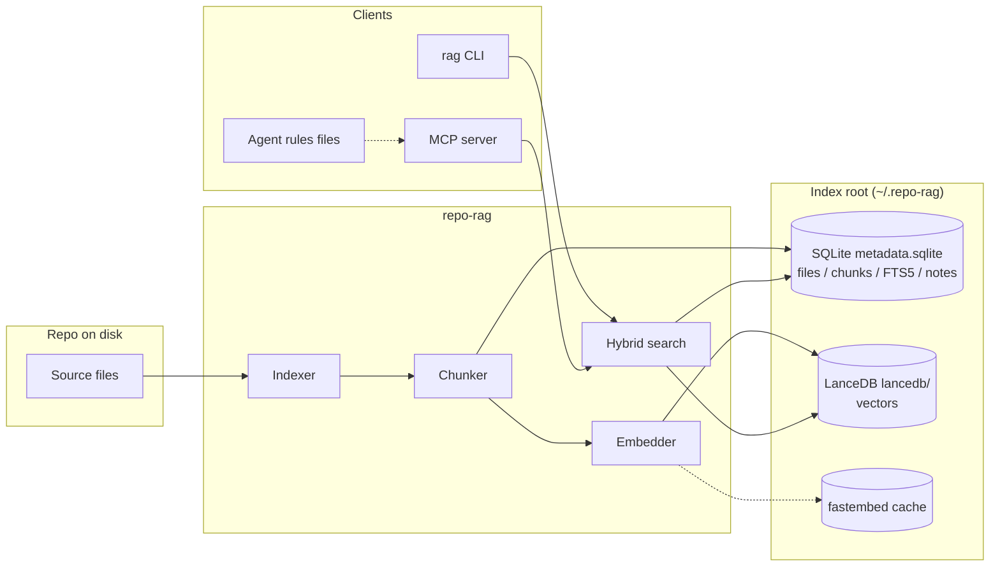

# Architecture

repo-rag has three pieces:

1. A **CLI** (`rag`) for indexing, searching, and managing notes / hooks /
   agent integrations.
2. An **MCP server** (`rag mcp-server`) that speaks the Model Context Protocol
   over stdio.
3. A **storage layer** under `~/.repo-rag/<repo-id>/` that holds one SQLite
   database, one LanceDB table, and a fastembed model cache.



## Storage layout

```
~/.repo-rag/
  registry.json                        # absolute path -> repo_id
  config.toml                          # global defaults (optional)
  <repo_id>/
    meta.json                          # {"repo_root": "...", "repo_id": "..."}
    metadata.sqlite                    # files, chunks, FTS5, notes, cache
    lancedb/
      chunks.lance/                    # vector table
    cache/
    logs/
```

`<repo_id>` is the repo directory's basename plus a 6-char hash if two repos
share a name. The registry survives `rag rebuild` so you do not have to
re-register repos.

## Indexing flow

1. **Scan** the working tree with the include / exclude globs from
   `config.toml` (or per-repo overrides) using `pathspec`.
2. **Filter** unchanged files (when `--changed` is set) by comparing
   `(path, mtime, sha256)` against the SQLite metadata.
3. **Chunk** each file. Code files use a ~500-token target with regex-driven
   function/class boundary preference; prose targets ~1500 tokens. Chunks
   carry `(path, start_line, end_line, language, content)`.
4. **Cache lookup**. Each chunk's embedding key is
   `(provider, model, dim, sha256(content))`. Hits bypass embedding.
5. **Embed** the misses in batches of `embedding.batch_size`. The default
   provider is fastembed (CPU ONNX); `sentence-transformers`, Ollama, and
   OpenAI-compatible HTTP backends ship as optional extras.
6. **Write** to SQLite (FTS5 index + chunk rows) and LanceDB (vector table)
   inside a single window. A window is `--window-size` files (default 16).
7. **Repeat** until done; periodically emit progress events the CLI renders
   as either a Rich progress bar or per-file log lines (`--sequential`).

## Search flow

`hybrid_search()` performs two independent retrievals and merges them:

- **Vector** search: top `top_k * 3` nearest neighbours in LanceDB by cosine
  similarity to the query embedding.
- **Keyword** search: SQLite FTS5 BM25 match on the same `top_k * 3`.

Both result sets are normalized to `[0, 1]` and combined with
`vector_weight * v + keyword_weight * k`. A small `recency_boost` is added
when a file was modified within the configured window. The top `top_k`
chunks are returned with source attribution (`"sources": ["vector", "keyword"]`).

`build_context_pack()` wraps the same call with a markdown formatter that
budgets a maximum token count, dedupes lines that already appear in the
remembered notes, and prepends those notes.

## Memory

Memory notes live in `metadata.sqlite` (`memory_notes` table) and survive
`rag rebuild` unless you pass `--wipe-memory`. The MCP server exposes
`repo_rag_remember` and `repo_rag_forget` so an agent can persist durable
facts across sessions without writing files.

## MCP layer

`mcp_server.py` registers five tools using `mcp.server.fastmcp`:

| Tool | Read-only | Idempotent |
|---|---|---|
| `repo_rag_search` | yes | yes |
| `repo_rag_get_context` | yes | yes |
| `repo_rag_remember` | no | no |
| `repo_rag_forget` | no | yes |
| `repo_rag_status` | yes | yes |

`ToolAnnotations(readOnlyHint=True, idempotentHint=True, openWorldHint=False)`
on the read-only tools is what lets MCP clients (Claude Code, Cursor, Factory
Droid, etc.) auto-approve them in tighter trust modes.

## Agent integration

The `agents/` package is a registry of plugins (one per AI coding agent) plus
a `UniversalAgent` that writes `AGENTS.md`. Each plugin knows where its host
agent reads rules and MCP configs from and edits only the marker-tagged block
inside those files. See [`docs/clients/`](clients/) for per-agent details.
